<div align="center">


<h1>Secrets Management Platform Blueprint</h1>

<p><strong>The Strategic Security Architecture for Vaulting, Rotating, and Governing Enterprise Secrets at Scale.</strong></p>

[]()
[]()
[]()

<br/>

> **"Identity is the new perimeter, and secrets are the keys to the kingdom."** 
> **Secret Management Blueprint (Secret-Vault)** is an enterprise-grade platform designed to provide a secure, measurable, and highly automated foundation for secret lifecycle management. It orchestrates the entire lifecycle—from secure storage and encryption-at-rest to dynamic generation, automatic rotation, and identity-based access control.

</div>

---

## 🏛️ Executive Summary

Credential leakage remains a leading cause of data breaches. Organizations often fail to secure their infrastructure not because of a lack of encryption, but because of hardcoded secrets and unmanaged rotation that creates a significant window of vulnerability across thousands of applications and services.

This platform provides the **Security Control Plane**. It implements a complete **Secrets Intelligence Framework**, enabling Security and Platform teams to manage cryptographic assets as a first-class citizen. By automating the generation of short-lived credentials and the orchestration of rotation procedures, we ensure that organizational secrets are not just stored, but dynamically managed, audited for compliance, and protected with Zero Trust principles.

---

## 📐 Architecture Storytelling: Principal Reference Models

### 1. Principal Architecture: Global Secret Management & Cryptographic Governance Plane
This diagram illustrates the end-to-end flow from multi-cloud identity authentication to dynamic secret generation, versioned storage, and institutional audit logging.

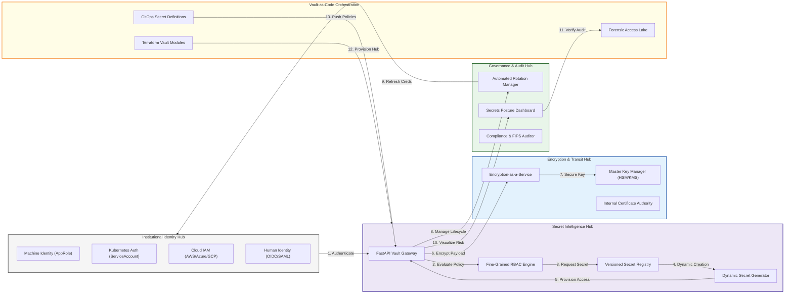

### 2. The Secret Lifecycle Management Flow
The continuous path of a secret from initial creation and encryption to automated rotation and secure revocation.

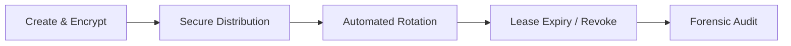

### 3. Multi-Cloud Secret Federation Hub
Centralizing the management of secrets across AWS Secrets Manager, Azure KeyVault, and Google Cloud KMS into a unified governance plane.

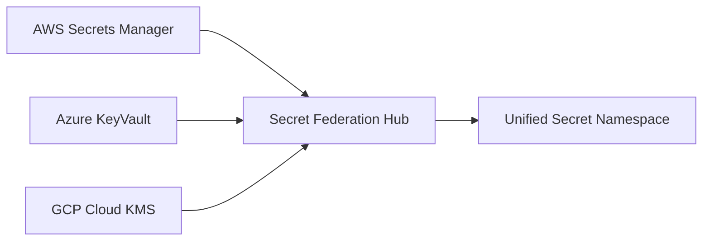

### 4. Identity-Based Secret Access (Auth Methods)
Standardizing how machines and humans authenticate to the vault using their native organizational identities.

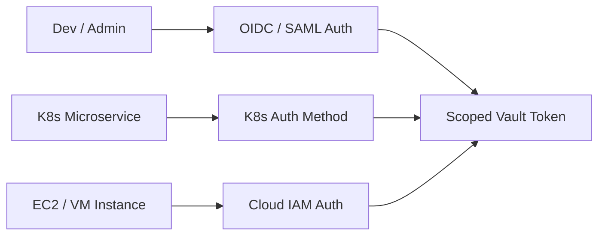

### 5. Dynamic Secret Generation Engine
Creating just-in-time, short-lived database and cloud credentials to eliminate the risk of long-lived static keys.

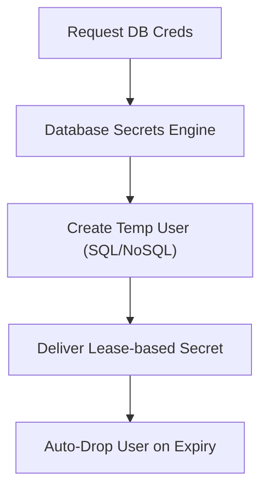

### 6. Secret Rotation Orchestration Hub
Automating the complex refresh cycle for database passwords, API keys, and certificates across the enterprise.

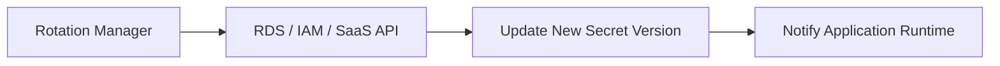

### 7. Encryption-as-a-Service (Transit Engine)
Offloading application-level cryptography to the vault to simplify key management and ensure compliance.

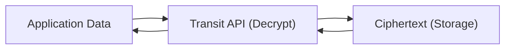

### 8. Identity & RBAC for Secret Governance
Managing fine-grained access isolation between machine-to-machine secrets and human administrative controls.

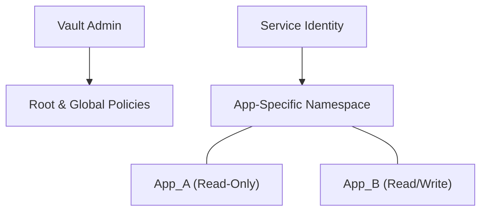

### 9. Institutional Compliance & Audit Hub
Generating FIPS 140-2, PCI-DSS, and SOC2 compliant evidence from live secret interaction and crypto-usage data.

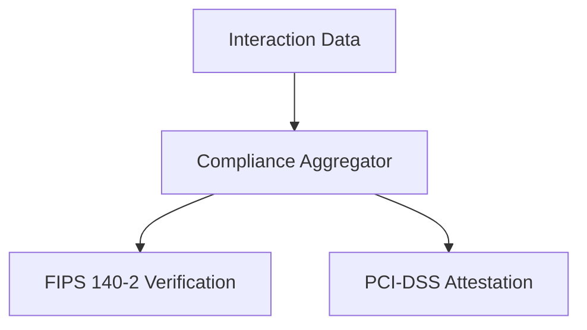

### 10. IaC Deployment: Vault-as-Code Framework
Using Terraform and Helm to deploy the declarative infrastructure for the secrets management platform.

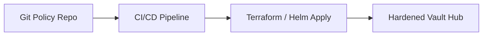

### 11. Metadata Lake for Forensic Secret Audit
Storing long-term records of every secret access, cryptographic operation, and policy change for institutional auditing.

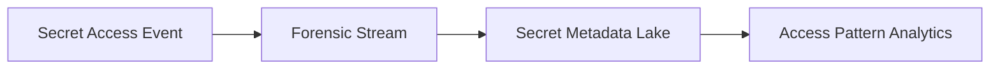

---

## 🏛️ Core Security Pillars

1.  **Secure Encryption Engine**: High-fidelity encryption-at-rest using master key isolation and versioned secret storage.
2.  **Identity-Based Access Control**: Fine-grained RBAC and policy-driven retrieval ensuring scoped identity access.
3.  **Automated Secret Rotation**: Event-driven workflows that refresh credentials based on age or risk triggers.
4.  **Leasing & Dynamic TTL**: Short-lived secret leases with automatic expiry for temporary credential governance.
5.  **Namespaced Multi-Tenancy**: Logical isolation of secrets across environments and organizational units.
6.  **Immutable Audit Governance**: Comprehensive logging of every secret interaction and version change for audit readiness.

---

## 🛠️ Technical Stack & Implementation

### Secrets Engine & APIs
*   **Framework**: Python 3.11+ / FastAPI.
*   **Encryption Engine**: AES-simulated encryption with master key derivation and envelope protection.
*   **Storage Engine**: Versioned key-value storage with logical namespacing and path-based routing.
*   **Access Control**: Identity-based policy evaluation with fine-grained RBAC and TTL-based leases.
*   **State Management**: PostgreSQL (Metadata Lake) and Redis (Lease Cache).

### Security Dashboard (UI)
*   **Framework**: React 18 / Vite.
*   **Theme**: Dark Violet / Slate (Modern Security aesthetic).
*   **Visualization**: Recharts for access trends and secret hygiene analytics.

### Infrastructure & DevOps
*   **Runtime**: AWS EKS or Azure Kubernetes Service (AKS).
*   **IaC**: Modular Terraform for deploying the vault hub and proxy distributions.

---

## 🏗️ IaC Mapping (Module Structure)

| Module | Purpose | Real Services |
| :--- | :--- | :--- |
| **`infrastructure/vault`** | Central management plane | EKS, PostgreSQL, Redis |
| **`infrastructure/identity`** | Auth methods and RBAC | Azure AD, AWS IAM, OIDC |
| **`infrastructure/storage`** | Encrypted backend and backup | EBS, RDS, S3 Glacier |
| **`infrastructure/monitoring`** | Audit and access logging | CloudWatch, ELK, Splunk |

---

## 🚀 Deployment Guide

### Local Principal Environment
```bash
# Clone the secrets blueprint
git clone https://github.com/devopstrio/secret-management-blueprint.git
cd secret-management-blueprint

# Configure environment
cp .env.example .env

# Launch the Security stack
make up

# Create an encrypted secret
make create-secret name="db_prod_pass" value="super-secure-123"

# Trigger automated secret rotation
make rotate-secrets
```

Access the Secrets Dashboard at `http://localhost:3000`.

---

## 📜 License
Distributed under the MIT License. See `LICENSE` for more information.

---
<div align="center">
  <p>© 2026 Devopstrio. All rights reserved.</p>
</div>
