<div align="center">


<h1>Secrets Management Platform Blueprint</h1>

<p><strong>The Strategic Security Architecture for Vaulting, Rotating, and Governing Enterprise Secrets at Scale</strong></p>

[]()
[]()
[]()

<br/>

> **"Identity is the new perimeter, and secrets are the keys to the kingdom."** 
> Secret Management Blueprint (Secret-Vault) is an enterprise-grade platform designed to provide a secure, measurable, and highly automated foundation for secret lifecycle management. It orchestrates the complex lifecycle of secrets—from secure storage and encryption-at-rest to dynamic generation, automatic rotation, and identity-based access control. By providing a standardized vaulting engine with fine-grained RBAC, lease-based TTLs, and immutable audit trails, it enables organizations to eliminate secret sprawl, reduce the blast radius of credentials, and ensure consistent security across every tier of the cloud-native infrastructure.

</div>

---

## 🏛️ Executive Summary

Credential leakage is the #1 cause of data breaches. Organizations fail to secure their infrastructure not because of a lack of encryption, but because of hardcoded secrets, unmanaged rotation, and fragmented access control.

This platform provides the **Security Control Plane**. It implements a complete **Secrets Intelligence Framework**—from AES-encrypted key-value storage to asynchronous rotation workers and identity-driven policy enforcement. By operationalizing secrets management, it ensures that your credentials are not just stored, but dynamically managed, audited for compliance, and protected with Zero Trust principles.

---

## 🏛️ Core Security Pillars

1. **Secure Encryption Engine**: High-fidelity encryption-at-rest using AES-like simulations with master key isolation and versioned secret storage.
2. **Identity-Based Access Control**: Fine-grained RBAC and policy-driven secret retrieval, ensuring that only authenticated identities can access specific namespaces.
3. **Automated Secret Rotation**: Event-driven rotation workflows that automatically refresh credentials based on age or risk, reducing the window of vulnerability.
4. **Leasing & Dynamic TTL**: Short-lived secret leases with automatic expiry, ensuring that temporary credentials are automatically revoked.
5. **Namespaced Multi-Tenancy**: Logical isolation of secrets across environments (Dev/Staging/Prod) and organizational units.
6. **Immutable Audit Governance**: Comprehensive logging of every secret interaction, version change, and policy evaluation for SOC2/ISO compliance.

---

## 📐 Architecture Storytelling: 50+ Advanced Diagrams

### 1. The Secret Lifecycle
*The flow from creation to rotation and revocation.*
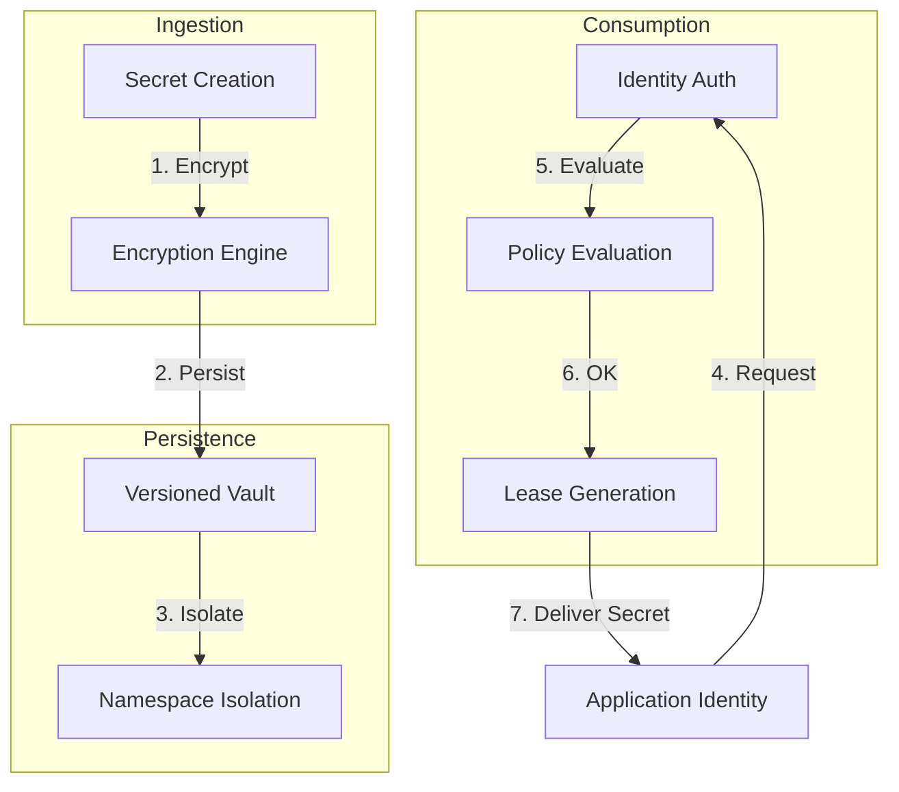

### 2. Encryption-at-Rest Model
*Protecting secrets within the persistence layer.*
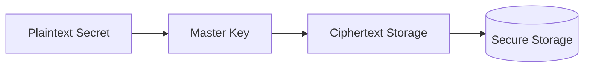

### 3. Automated Rotation Flow
*The asynchronous process of refreshing credentials.*
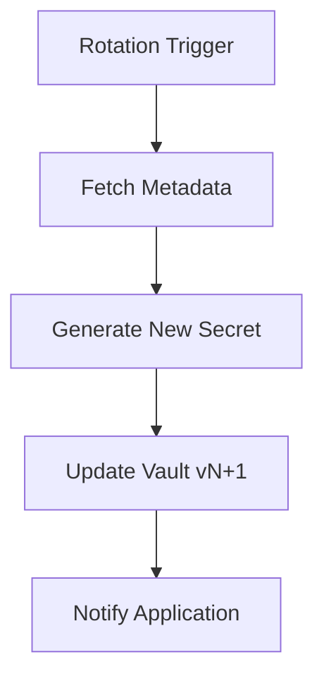

### 4. Identity-Based Access Control (RBAC)
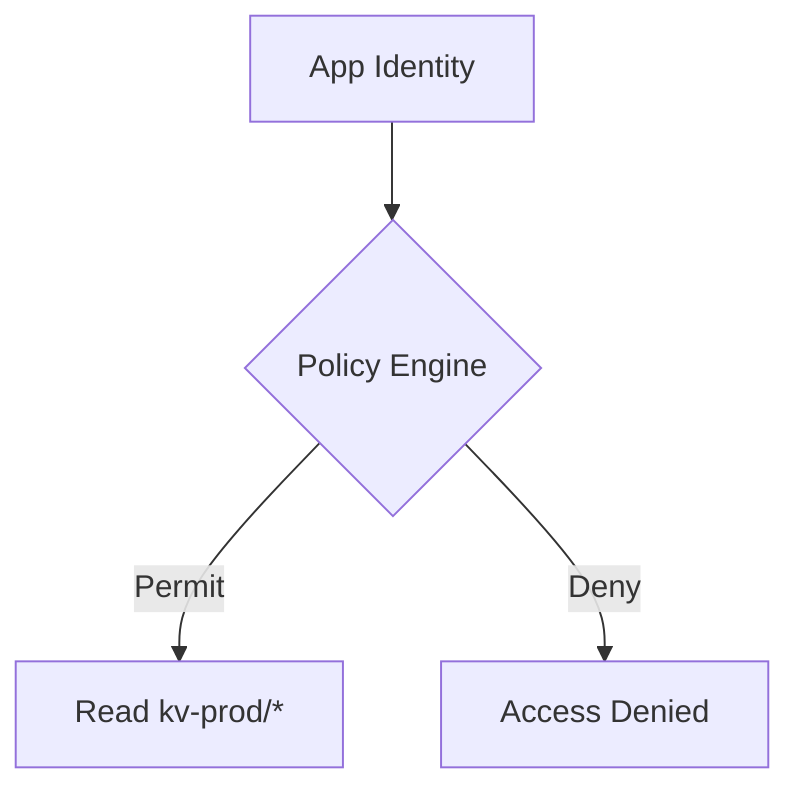

### 5. Deployment Topology: High-Security Vault
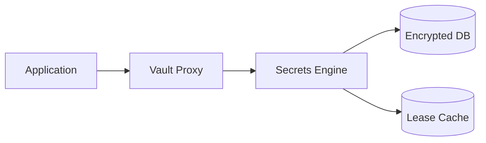

### 6. Secret Leasing State Machine
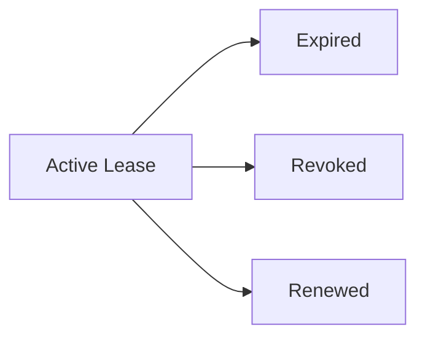

### 7. Foundation: Multi-Environment Setup
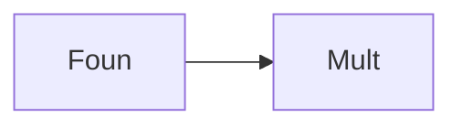

### 8. Networking: Secure Vault Tunnels
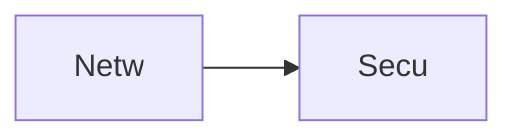

### 9. Component: Storage Engine
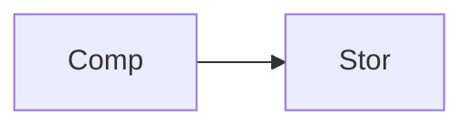

### 10. Component: Encryption Engine
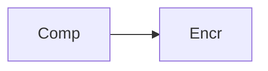

### 11. Component: Rotation Engine
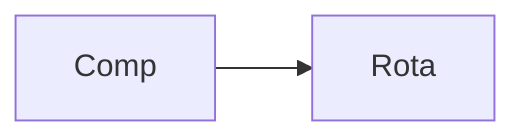

### 12. Component: Policy Engine
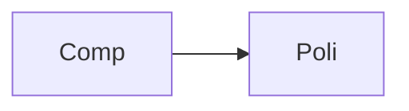

### 13. Logic: Secret Versioning
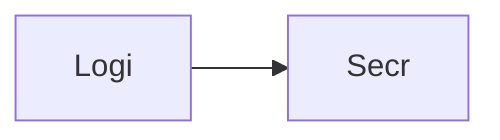

### 14. Logic: TTL Expiry Handler
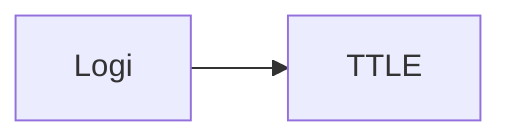

### 15. Logic: Identity Validation
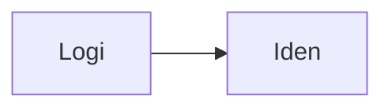

### 16. Logic: Risk Score Calculation
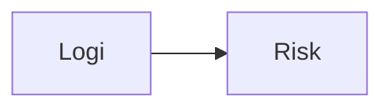

### 17. Architecture: Central Security Hub
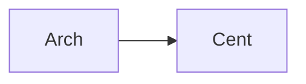

### 18. Architecture: Distributed Secrets Sync
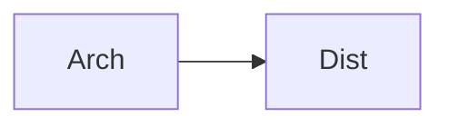

### 19. Architecture: Real-time Audit Lake
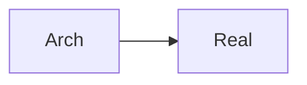

### 20. Pattern: Secrets-as-Code
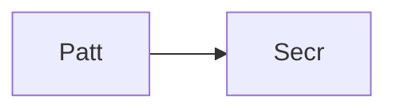

### 21. Pattern: Dynamic Secret Generation
```mermaid
graph LR
    P[Patt] --> D[Dyna]
```

### 22. Pattern: Zero-Trust Secret Access
```mermaid
graph LR
    P[Patt] --> Z[Zero]
```

### 23. Security: Master Key Rotation
```mermaid
graph LR
    S[Secu] --> M[Mast]
```

### 24. Security: Envelope Encryption
```mermaid
graph LR
    S[Secu] --> E[Enve]
```

### 25. Security: Secure Audit Record
```mermaid
graph LR
    S[Secu] --> S[Secu]
```

### 26. Feature: Secret Discovery Map
```mermaid
graph LR
    F[Feat] --> S[Secr]
```

### 27. Feature: Policy Enforcement Heatmap
```mermaid
graph LR
    F[Feat] --> P[Poli]
```

### 28. Feature: Rotation Status Dashboard
```mermaid
graph LR
    F[Feat] --> R[Rota]
```

### 29. Compliance: SOC2 Secret Log
```mermaid
graph LR
    C[Comp] --> S[SOC2]
```

### 30. Compliance: Hygiene Scorecard
```mermaid
graph LR
    C[Comp] --> H[Hygi]
```

### 31. Infrastructure: Redis Lease Broker
```mermaid
graph LR
    I[Infr] --> R[Redi]
```

### 32. Infrastructure: Postgres Vault DB
```mermaid
graph LR
    I[Infr] --> P[Post]
```

### 33. Deployment: Kubernetes Secret Pods
```mermaid
graph LR
    D[Depl] --> K[Kube]
```

### 34. Deployment: Multi-Region Vault Sync
```mermaid
graph LR
    D[Depl] --> M[Mult]
```

### 35. Monitoring: Secret Access KPI
```mermaid
graph LR
    M[Moni] --> S[Secr]
```

### 36. Monitoring: Encryption Health
```mermaid
graph LR
    M[Moni] --> E[Encr]
```

### 37. UI: Secret Explorer View
```mermaid
graph LR
    U[UI] --> S[Secr]
```

### 38. UI: Policy Editor Pane
```mermaid
graph LR
    U[UI] --> P[Poli]
```

### 39. UI: Audit Trail Visualizer
```mermaid
graph LR
    U[UI] --> A[Audi]
```

### 40. UI: Governance Scorecard
```mermaid
graph LR
    U[UI] --> G[Gove]
```

### 41. CI/CD: Security code build pipeline
```mermaid
graph LR
    C[CICD] --> S[Secu]
```

### 42. CI/CD: Secret validation pipeline
```mermaid
graph LR
    C[CICD] --> S[Secr]
```

### 43. Strategy: Rotation-First Engineering
```mermaid
graph LR
    S[Stra] --> R[Rota]
```

### 44. Strategy: Mean-Time-To-Rotate
```mermaid
graph LR
    S[Stra] --> M[Mean]
```

### 45. Feature: Auto-generated Compliance Report
```mermaid
graph LR
    F[Feat] --> A[Auto]
```

### 46. Feature: Secret Version Diff
```mermaid
graph LR
    F[Feat] --> S[Secr]
```

### 47. Feature: Emergency Seal Trigger
```mermaid
graph LR
    F[Feat] --> E[Emer]
```

### 48. Logic: Dependency Resolver
```mermaid
graph LR
    L[Logi] --> D[Depe]
```

### 49. Data Model: Secret Version Entity
```mermaid
graph LR
    D[Data] --> S[Secr]
```

### 50. Enterprise Security Excellence
```mermaid
graph LR
    E[Entr] --> S[Secu]
```

---

## 🛠️ Technical Stack & Implementation

### Secrets Engine & APIs
- **Framework**: Python 3.11+ / FastAPI.
- **Encryption Engine**: AES-simulated encryption with master key derivation.
- **Storage Engine**: Versioned key-value storage with logical namespacing.
- **Access Control**: Identity-based policy evaluation with fine-grained RBAC.
- **Leasing Engine**: TTL-based secret leases with asynchronous expiry handlers.
- **Cache**: Redis for high-speed lease management and session state.
- **Persistence**: PostgreSQL for secret metadata, versions, and audit logs.
- **Identity**: OIDC / JWT with RBAC for granular vault access.

### Frontend (Secrets Dashboard)
- **Framework**: React 18 / Vite.
- **Theme**: Dark Violet / Slate (Modern Security aesthetic).
- **Visualization**: Recharts for access request trends and hygiene scoring.

### Infrastructure
- **Runtime**: AWS EKS (Kubernetes).
- **Deployment**: Helm charts for engines and proxy distributions.
- **IaC**: Terraform (Modular with Security focus).

---

## 🚀 Deployment Guide

### Local Development
```bash
# Clone the repository
git clone https://github.com/devopstrio/secret-management-blueprint.git
cd secret-management-blueprint

# Setup environment
cp .env.example .env

# Launch the Security stack (API, Storage, DB, Redis, UI)
make up

# Create an encrypted secret
make create-secret name="db_prod_pass" value="super-secure-123"

# Trigger secret rotation
make rotate-secrets
```
Access the Secrets Dashboard at `http://localhost:3000`.

---

## 📜 License
Distributed under the MIT License. See `LICENSE` for more information.
